

  

 PebbleOS 

  
  
  

> **Fork note (`v4.36.2-ua-branch`):** personal daily-driver branch by
> [uaparit](https://github.com/uaparit), the build actually flashed to the watch. Based on
> [`v4.36.2`](https://github.com/coredevices/PebbleOS/releases/tag/v4.36.2). Released builds are
> tagged `v4.36.2-uaX.Y` on this branch (see
> [Releases](https://github.com/uaparit/PebbleOS/releases)) — the branch name itself doesn't
> carry a patch number, since a new `ua` tag doesn't always mean new commits here (e.g. a
> rebuild with a different compile flag).
>
> Backported from upstream `main` (not yet in the `4.36.x` release line), 7 commits by Jeff
> Hampton that add the "Text Size" preference (Settings → Display):
> - [`fd4777e58`](https://github.com/coredevices/PebbleOS/commit/fd4777e58) fw/shell: design the ExtraLarge text tier
> - [`a971489be`](https://github.com/coredevices/PebbleOS/commit/a971489be) fw/applib/ui: design ExtraLarge menu cell dimensions
> - [`e6509c418`](https://github.com/coredevices/PebbleOS/commit/e6509c418) fw/applib/ui: honor preferred content size in system menus
> - [`aff65c73a`](https://github.com/coredevices/PebbleOS/commit/aff65c73a) fw/shell/prf: stub out the content size preference
> - [`3c2fe5ff7`](https://github.com/coredevices/PebbleOS/commit/3c2fe5ff7) fw/apps/system/settings: use the standard cell height for the root menu
> - [`d7f2ede0c`](https://github.com/coredevices/PebbleOS/commit/d7f2ede0c) fw/apps/system/settings: move Text Size to Display
> - [`6388ba14f`](https://github.com/coredevices/PebbleOS/commit/6388ba14f) fw: relayout open settings menus on text size change
>
> Added on top:
> - the app launcher (main menu) now follows Text Size too — fonts, row height, glance cache
>   size, and the Settings glance's battery/charging icons
> - system-menu cell height/font aligned with the launcher's (was mismatched at "Large")
> - the watchface picker now follows Text Size too
> - system option menus (radio-button lists), including the Text Size picker itself, now follow
>   Text Size too
> - the Health app now always cycles between cards (Steps/HR/Sleep), regardless of how it was
>   launched — quick-launching it via a directional button used to exit to the watchface at the
>   list boundary instead of wrapping
> - a new Settings → Themes screen: an Accent Color picker (11 presets, plus "Invert" which
>   tracks whatever the background is set to) and a Background switch (Light/Dark) — both apply
>   live across every system menu (Settings, launcher, watchfaces, notifications, option menus),
>   including already-open windows further down the navigation stack
> - the Settings menu's icons are enabled (existing, unused-until-now firmware feature) and its
>   main list is back to a white background by default (a stray leftover from an upstream
>   redesign attempt that was otherwise reverted in Feb 2026)
>
> See the commit history for full details.

### Text Size screenshots

Captured under QEMU (`qemu_emery`, same 200×228 display as `obelix`/Pebble Time 2), one column
per Text Size setting. "Smaller"/"Default"/"Larger" are the labels shown in the Settings app;
they map to the `PreferredContentSize` tiers `Medium`/`Large`/`ExtraLarge` (`Large` is the
default on rectangular displays).

| | Smaller (`Medium`) | Default (`Large`) | Larger (`ExtraLarge`) |
|---|---|---|---|
| Main menu | 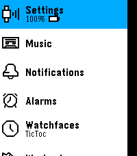 | 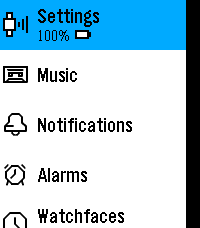 | 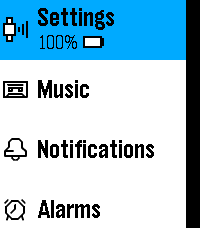 |
| Settings menu | 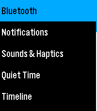 | 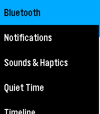 | 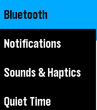 |
| Watchfaces menu | 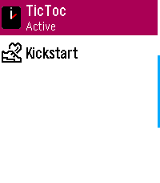 | 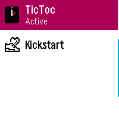 | 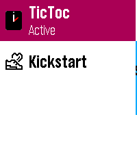 |
| Display menu | 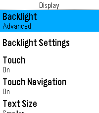 | 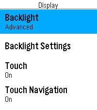 | 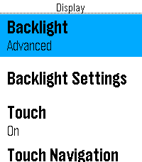 |
| Bluetooth | 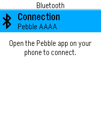 | 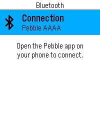 | 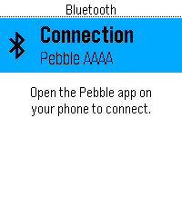 |

### Theme screenshots

Also captured under QEMU (`qemu_emery`), Background × Accent Color combinations. "Invert" isn't
a fixed hue — it always resolves to the opposite of whatever Background is set to.

| | Invert | Green | Magenta |
|---|---|---|---|
| Main menu (Light) | 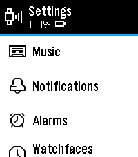 | 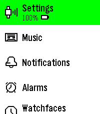 | 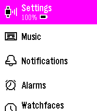 |
| Settings menu (Light) | 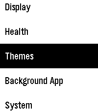 | 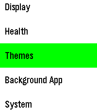 | 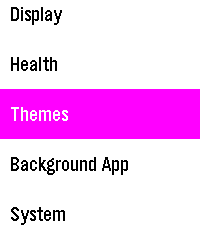 |
| Main menu (Dark) | 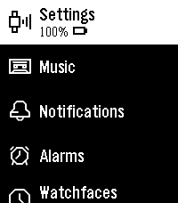 | 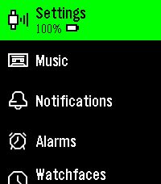 | 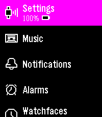 |
| Settings menu (Dark) | 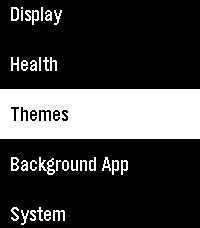 | 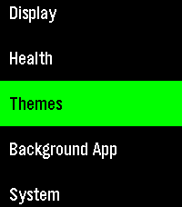 | 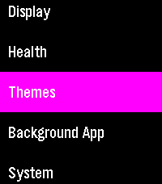 |

## Resources

Here's a quick summary of resources to help you find your way around:

### Getting Started

- 📖 [Documentation](https://pebbleos-core.readthedocs.io/en/latest)
- 🚀 [Prerequisites Guide](https://pebbleos-core.readthedocs.io/en/latest/development/getting_started.html)

### Code and Development

- ⌚ [Source Code Repository](https://github.com/coredevices/PebbleOS)
- 🐛 [Issue Tracker](https://github.com/coredevices/PebbleOS/issues)
- 🤝 [Contribution Guide](CONTRIBUTING.md)

### Community and Support

- 💬 [Discord](https://discordapp.com/invite/aRUAYFN)
- 👥 [Discussions](https://github.com/coredevices/PebbleOS/discussions)
